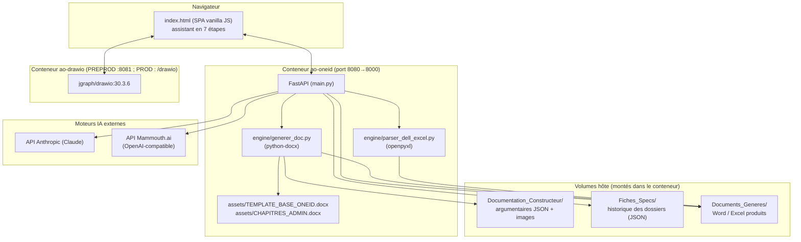

# Architecture — Générateur d'appel d'offre ONE ID

## Vue d'ensemble

Application monolithique locale (pas de micro-services), conteneurisée avec Docker Compose.
Un seul backend FastAPI sert à la fois l'API et la page HTML unique (SPA sans framework JS,
vanilla JS dans `app/web/index.html`). Un second conteneur héberge l'éditeur de schémas draw.io.

## Composants

### `app/main.py` — API FastAPI
Point d'entrée unique. Sert la page (`GET /`), expose les endpoints IA (analyse CCTP,
proposition de chapitres, vérification de conformité, reformulation, mode Design), les
endpoints de génération de documents (Word, Excel, mémoire technique), et le CRUD des
fiches de specs et des argumentaires. Détail exhaustif : `docs/FONCTIONS.md`.

### `app/engine/generer_doc.py` — moteur de génération Word
Script exécuté en sous-processus par `main.py` (`subprocess.run`) et non importé
directement. Prend en entrée un JSON (fiche de specs) et produit un `.docx` à partir du
template `TEMPLATE_BASE_ONEID.docx`, en insérant les argumentaires sourcés depuis
`Documentation_Constructeur/`. Fusionne en fin de document les chapitres administratifs
figés (`CHAPITRES_ADMIN.docx` via `docxcompose`).

### `app/recap_cctp.py` — récapitulatif CCTP (module pur)
Contrat des 3 tableaux du récapitulatif CCTP (`TABLES` : clés et libellés des colonnes),
statuts autorisés, colonnes à fort contenu à élargir (`WIDE_COLS`), prompt système (issu
de l'optimisation Lyra) et normalisation de la
réponse IA. Il est importé par `main.py` (`/api/recap-cctp`) et par
`engine/generer_doc.py`, qui ajoute `app/` à son `sys.path`. Il ne fait aucun appel réseau
ni d'E/S. Les colonnes sont recopiées en dur dans `index.html` (`RECAP_TABLES`) ; un test
vérifie qu'elles restent identiques des deux côtés.

### `app/recap_admin.py` — focus administratif et contractuel (module pur)
Il a la même structure que `recap_cctp.py`, dont il réutilise les fonctions de cellule et de
statut : `TABLES` (checklist, contractuel, questions), `NIVEAUX`, `WIDE_COLS`, prompt
système, assemblage des documents (`build_user_message`) et normalisation. Il est importé par
`main.py` (`/api/recap-admin`) et par `engine/generer_doc.py`.

### `app/engine/parser_dell_excel.py` — parseur Excel Dell
Script exécuté en sous-processus, transforme un export Dell Solutions Configurator
(.xlsx) en JSON classé par catégorie (serveurs/stockages/switches/sauvegardes/logiciels)
compatible avec le format attendu par `generer_doc.py`.

### `app/web/index.html` — frontend
SPA unique, aucun bundler ni framework : JS vanilla embarqué dans la page. Assistant en
7 étapes (CCTP, équipements, fonctionnalité, structure/Kanban, prestations, planning,
documents). Un instantané horodaté est conservé à chaque changement de version
(`app/web/versions/index_vX.Y.html`) par la fonction `_archive_frontend()` de `main.py`.

### Éditeur draw.io (`jgraph/drawio:30.3.6`)
Service Docker séparé, 100 % local (variables `DRAWIO_GOOGLE_CLIENT_ID` et
`DRAWIO_MSGRAPH_CLIENT_ID` vidées pour désactiver les intégrations cloud). Le schéma est
exporté en PNG (XML ré-éditable embarqué) et transmis au générateur Word.
En PREPROD l'iframe vise `http://<hôte>:8081`. En PROD (même hôte HTTPS, pas de
listener 8081 joignable) l'iframe vise `https://ao-id.one-id.fr/drawio` ; les
bibliothèques XML restent servies par AO-ID (`GET /drawio-libs/{name}`).

## Dépendances externes

| Dépendance | Rôle | Obligatoire |
|---|---|---|
| API Anthropic (Claude) | Analyse CCTP, reformulation, vérification, mode Design | Non — clé optionnelle, sinon fonctions IA indisponibles |
| API Mammouth.ai | Moteur IA alternatif (OpenAI-compatible), moteur par défaut depuis v2.3 | Non |
| Docker Desktop / Docker Engine | Exécution des deux conteneurs | Oui |
| Police "Assistant" | Rendu fidèle du Word généré | Non (dégradé gracieux si absente sur le poste qui ouvre le document) |

## Flux de données

1. L'utilisateur dépose un CCTP → `POST /api/analyse-cctp` → appel au moteur IA choisi →
   contexte + points d'attention renvoyés au frontend (rien n'est persisté à cette étape).
1bis. Dès que l'analyse réussit, le frontend enchaîne `POST /api/recap-cctp` (CCTP + points
   + clarifications + résumé de la solution) → 3 tableaux affichés dans l'onglet 2, modifiables,
   stockés dans `affaire.recap_cctp` de la fiche, puis rendus dans le Word par
   `section_recap_cctp` (section paysage, après le planning).
1ter. Onglet 3 : l'utilisateur dépose les documents administratifs → `POST /api/admin-docs/extract`
   (texte renvoyé et stocké dans `affaire.admin_docs`) → bouton « Générer » → `POST /api/recap-admin`
   → tableaux modifiables stockés dans `affaire.recap_admin`, puis rendus par `section_recap_admin`
   (même section paysage que le récap technique).
2. L'utilisateur importe un export Dell (.xlsx) → `POST /api/import-excel` → sous-processus
   `parser_dell_excel.py` → JSON classé renvoyé au frontend.
3. Le frontend accumule un objet JSON unique ("spec") en mémoire navigateur au fil des 7
   étapes (aucune base de données ; le state vit côté client jusqu'à sauvegarde explicite).
4. `POST /api/fiche/save` persiste ce JSON tel quel dans `Fiches_Specs/<nom>.json`.
5. `POST /api/generer` sérialise le JSON dans un fichier temporaire, lance
   `generer_doc.py` en sous-processus, qui lit aussi `Documentation_Constructeur/` pour
   les argumentaires, et écrit le `.docx` final dans `Documents_Generes/`.
6. `POST /api/chiffrage` construit un `.xlsx` directement en mémoire (openpyxl, pas de
   sous-processus) à partir du même JSON, écrit dans `Documents_Generes/`.
7. `POST /api/memoire` lit une trame client (docx/pdf/txt) + le contenu de l'AO déjà
   généré (ou son résumé), appelle le moteur IA, produit un `.docx` récapitulatif.

## Limites connues d'architecture

- Pas de base de données : toute la persistance est en fichiers JSON/Word/Excel sur
  disque, montés en volumes Docker. Aucune concurrence gérée (deux utilisateurs
  simultanés peuvent écraser la même fiche).
- Les scripts `engine/*.py` sont invoqués en sous-processus plutôt qu'importés : plus
  robuste à l'isolement mais plus lent et sans partage direct d'état/logging avec
  `main.py`.
- Aucune authentification : l'application n'est prévue que pour un usage local
  (`localhost:8080`), non exposée publiquement en l'état.
